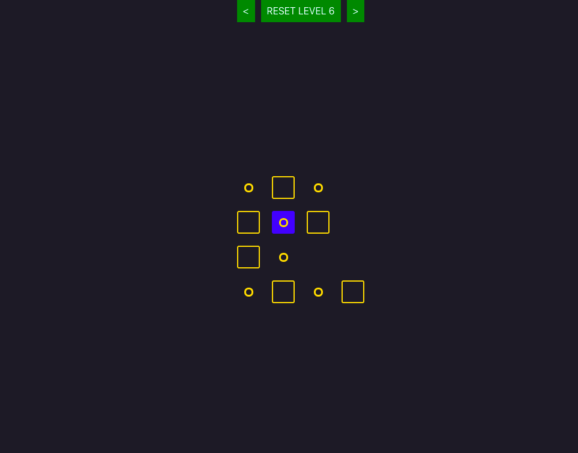

# Monodes

Simple puzzle game inspired by [Peg solitaire](https://en.wikipedia.org/wiki/Peg_solitaire). Merge neighbor squares and left the last one on the marked destination.

[Play the demo](https://valentatomas.github.io/monodes "Level \"8\" is hard as hell...")

